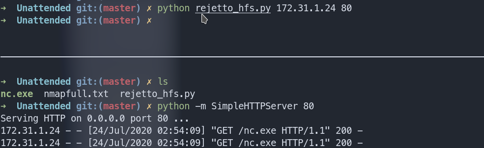
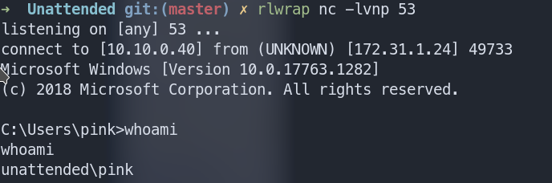
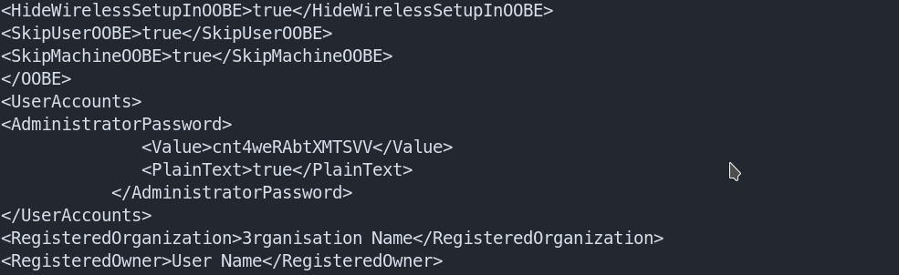
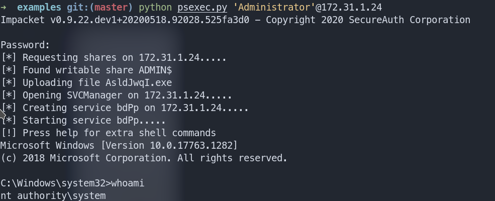

# CyberSecLabs : Unattended : 172.31.1.24

Nmap scan

Rjetto HttpFileServer 2.3 at port 80

https://github.com/am0nsec/exploit/blob/master/windows/http/RejettoHTTPFileServer-2.3/rejetto_hfs.py


Host nc.exe at port 80 in your machine using python, change your IP and local port for listener.

Start the listener





Run winpeas. Check Unattend.xml

```type C:\Windows\Panther\Unattend.xml```



For logging as admin use psexec.py

